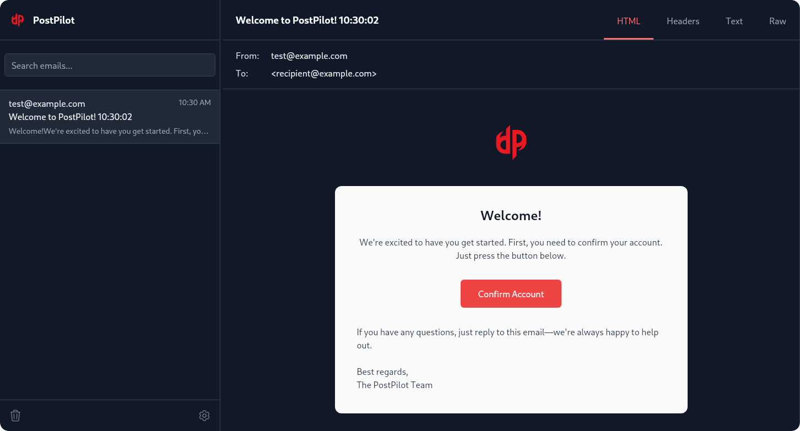

<div align="center">
  
  <h1>PostPilot</h1>
  <p><em>A sleek local SMTP testing environment for developers</em></p>
</div>

## 🚧 Work in Progress

PostPilot is currently under active development. While the core functionality is being built, the project is not yet ready for production use. Stay tuned for updates!

<div align="center">
  
</div>

## About

PostPilot is a developer tool inspired by Laravel Herd's mail panel, designed to simplify email testing during development. It provides a local SMTP server that captures outgoing emails and displays them in a modern, user-friendly interface.

## Features (Planned)

- 📬 Local SMTP server for email testing
- 🎨 Modern, responsive UI built with React and Tailwind CSS
- 🌓 Light/Dark mode support
- 📱 Preview emails in different formats (HTML, Text, Raw)
- 🔍 Search and filter capabilities
- ⚡ Built with Wails for native performance

## Development

To get started with development:

1. Install dependencies:
~```bash
# Install frontend dependencies
cd frontend
npm install

# Install Go dependencies
go mod tidy
~```

2. Run in development mode:
~```bash
wails dev
~```

This will start the development server with hot reload support. The application will be available at `http://localhost:34115`.

## Building

To build a production version:

~```bash
wails build
~```

## Contributing

As this project is still in early development, we're not yet accepting contributions. However, feel free to star the repository and watch for updates!

## License

This project is licensed under the MIT License.

## Acknowledgments

- Inspired by Laravel Herd's mail panel
- Built with [Wails](https://wails.io/)
- Uses [React](https://reactjs.org/) and [Tailwind CSS](https://tailwindcss.com/)